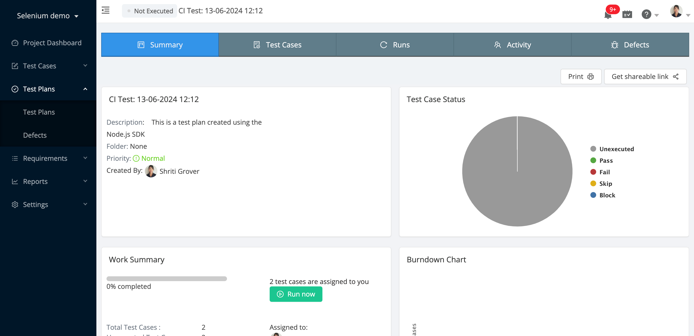
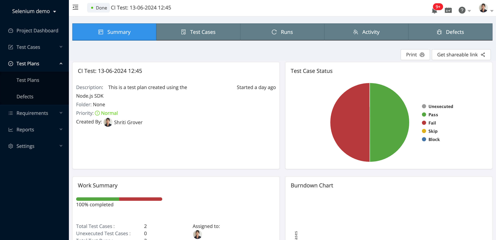

# Selenium integration with Test Collab

This project demonstrates how to upload your selenium test report to [Test Collab]([https://testcollab.com/)], with your CI/CD pipeline.

## Prepare your Test Collab instance

We recommend creating a tag named 'ci' or with a similar name, to cluster all test cases that are part of your CI/CD pipeline. Apply this tag to required test cases. These are the test cases which will be included in your report for every build.

1. Select a project > Click 'Tags' under test cases tab on left
2. Create a tag
3. Keep a note of the tag id, from "..." and hovering edit link (you will need this later)

Also obtain your project id, company id and user id that these test report will be assigned to. In case of CI/CD pipelines, although the test execution is fully autonomous, but Test Collab still requires an assignee to be present. This could be your own user id.

Next, create a new API key as explained here: https://help.testcollab.com/en/articles/5299051-getting-an-api-token-generated

## Setup

- Initialize env file  

    cp sample.env .env

- Fill all the related values in .env

    NODE_ENV=production

    TESTCOLLAB_API_KEY=

    TESTCOLLAB_PROJECT_ID=

    TESTCOLLAB_CI_TAG_ID=

    TESTCOLLAB_ASSIGNEE_ID=

    TESTCOLLAB_COMPANY_ID=

## Firing a test run

Let's trigger our selenium test cases now (this will open chrome)

    npm run test

Now we'll create a test plan in your Test Collab project.

    npm run createTestPlan

At this point you'll be able to see this new test plan under Test Plans menu.
However, all test cases will show up as 'Unexecuted' as shown in image below:

After all the test cases are done, you'll see the report file:
./mochawesome-report/mochawesome.json

Now, finally, we send the results to Test Collab:

    npm run report

